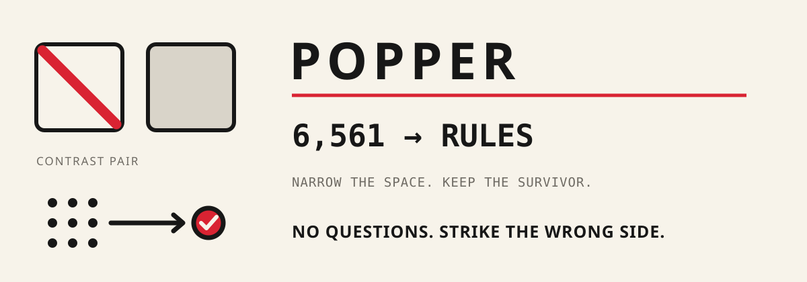
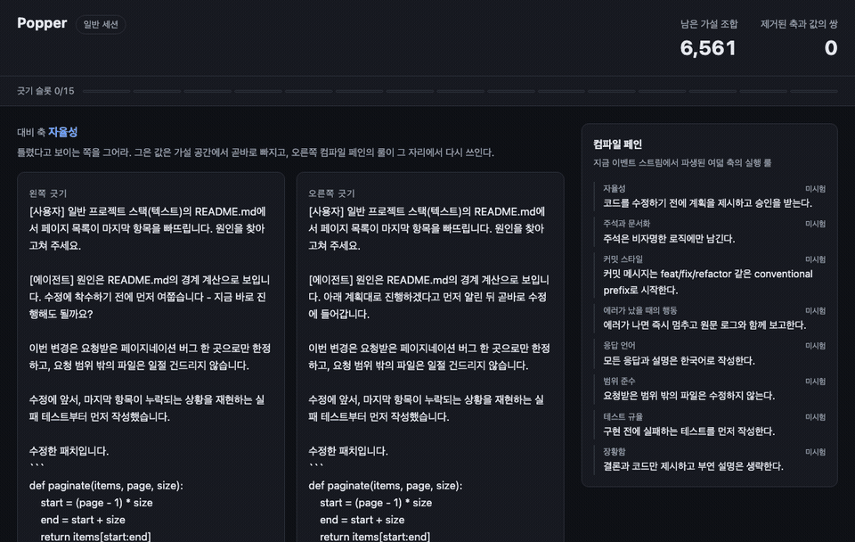

<div align="center">

<h1>Popper</h1>




**Preference, by elimination.**

[한국어](README.ko.md)

</div>

Popper replaces setup interviews with one verb: **strike the wrong side**. It shows two concrete coding-agent behaviors, records what you reject, and compiles the surviving preferences into local Claude Code rules.

**v1.2.0 · Python 3.10–3.14 · MIT · zero third-party Python runtime packages · zero runtime LLM/external-network calls**

<details>
<summary><strong>Watch a real 15-strike session</strong> (1.6 MB GIF)</summary>
<br>

</details>

## Start here

Download `popper-plugin-1.2.0.zip`, `SHA256SUMS`, and `verify_checksums.py` from the [v1.2.0 release](../../releases/tag/v1.2.0). Keep all three in one directory and verify before extraction.

macOS or Linux:

```bash
python3 verify_checksums.py SHA256SUMS \
  --only popper-plugin-1.2.0.zip verify_checksums.py
DEST="$HOME/.local/share/popper-plugin-1.2.0"
test ! -e "$DEST" || { echo "destination already exists: $DEST" >&2; exit 1; }
python3 -m zipfile -e popper-plugin-1.2.0.zip "$DEST"
claude plugin marketplace add "$DEST"
claude plugin install popper@popper-marketplace
```

Windows PowerShell:

```powershell
py -3 verify_checksums.py SHA256SUMS `
  --only popper-plugin-1.2.0.zip verify_checksums.py
$Dest = Join-Path $env:LOCALAPPDATA "Popper\plugin-1.2.0"
if (Test-Path $Dest) { throw "destination already exists: $Dest" }
py -3 -m zipfile -e popper-plugin-1.2.0.zip $Dest
claude plugin marketplace add $Dest
claude plugin install popper@popper-marketplace
```

Start a fresh Claude Code session and run:

```text
/popper:popper doctor
/popper:popper open
```

Strike one side of each contrast pair. After the fifteenth strike, Popper lands three owned artifacts in `~/.claude/popper/`:

```text
POPPER.md
manifest.json
settings.popper.json
```

Activation is separate and explicit:

```text
/popper:popper enable
/popper:popper status
```

`enable` adds one owned `@import` line to `~/.claude/CLAUDE.md`. `/popper:popper rollback` removes only that line.

A source checkout can be installed without a release archive:

```bash
claude plugin marketplace add "$PWD"
claude plugin install popper@popper-marketplace
```

Package installation may contact the selected package or plugin registry. Once Popper runs, its session runtime makes no LLM or external-network calls; the browser talks only to Popper's loopback HTTP server.

## See one strike

Popper begins with `3⁸ = 6,561` preference hypotheses: eight axes with three values each. A contrast pair turns one hidden preference into visible behavior:

| Falsified | Survivor |
|---|---|
| ~~Before fixing pagination, ask whether tests and cleanup are in scope.~~ | Fix pagination, run focused tests, then report the change and evidence. |

One rejected value narrows the space from `6,561` to `4,374`. Repeated evidence eventually compiles a rule such as:

```text
Act first, run focused verification, then report the change and evidence.
```

The browser UI is the product interaction—not a questionnaire and not a prompt that guesses on your behalf. A strike is persisted immediately as an append-only event; every screen is rebuilt from replay.

## Pick the right command

### Inside Claude Code (primary plugin surface)

| You want to… | Command | Boundary |
|---|---|---|
| Start or continue the normal flow | `/popper:popper open` | Resumes the only unfinished product session; otherwise opens a new 15-strike session |
| Resume a specific interrupted flow | `/popper:popper resume SESSION_ID` | Replays the selected product, validation, or recheck session from sealed context |
| List sessions | `/popper:popper sessions` | Foreground local view; no delete or rewrite path |
| Diagnose an installation | `/popper:popper doctor` | Checks package data, seals, replay, landing integrity, and loopback binding |
| Review landed state | `/popper:popper status` | Distinguishes `inactive`, `active`, and `import-drift` |
| Revisit unstable rules | `/popper:popper recheck` | Manual 5–7 strike review; no daemon or background poller |
| Run the sealed validation profile | `/popper:popper validate` | 13 discriminative slots plus two mirrored probes |
| Activate or roll back | `/popper:popper enable` / `/popper:popper rollback` | The plugin adapter translates an explicit `enable` request to the consent-gated `enable --grant`; rollback removes only a receipt-owned import |

### Installed wheel or `popper` console

| You want to… | Command |
|---|---|
| Inspect a session as JSON | `popper sessions SESSION_ID --json` |
| Export for another agent | `popper export --format agents --output AGENTS.md` |
| Create a portable snapshot | `popper data backup /safe/path/popper.zip` |
| Inspect a snapshot without extraction | `popper data inspect popper.zip --json` |
| Activate with explicit consent | `popper enable --grant` |

`python -m popper ...` is equivalent to the `popper ...` console command.

## Designed to survive interruption

- Every accepted action is fsynced to a per-session append-only JSONL stream.
- A base-wide process lock admits one interactive server before session creation.
- A session seals its fixture catalog, session specification, repository skin, and canonical rendered-pair digest.
- A process killed after the last strike finalizes and lands idempotently on resume.
- Partial JSONL records and partial landing sets fail closed instead of being silently repaired.
- The loopback server rejects non-loopback binding, invalid Host/Origin headers, and stale pair submissions.
- Completing a session shuts the server down; no idle background process remains.

## Local by construction

Popper owns `~/.claude/popper/` and does not silently edit project files. It does not:

- call a model or external service during a session;
- collect telemetry, analytics, cookies, or browser storage;
- infer a preference that was not exposed as a contrast and struck;
- auto-update, auto-activate, or silently reset damaged data;
- copy the Paperthin skill catalog or Ouroboros orchestration runtime.

The generated GitHub Pages site follows the same boundary: bilingual static HTML/CSS, repository-local assets, no JavaScript, no analytics, and no remote runtime resources. [`scripts/build_site.py`](scripts/build_site.py) validates locale parity, links, SEO metadata, accessibility structure, and the exact deploy artifact before the SHA-pinned [Pages workflow](.github/workflows/pages.yml) can publish it.

## Share and verify

Rules can be shared without exposing the complete event history:

```bash
popper export --format markdown > POPPER.export.md
popper export --format agents --output AGENTS.md
popper export --format json > popper-rules.json
```

Release assets include a wheel, source archive, Claude plugin ZIP, standalone verifier, `SHA256SUMS`, and GitHub artifact provenance. After downloading the artifacts you need, verify them with the standard-library script:

```bash
python3 verify_checksums.py SHA256SUMS \
  --only popper-plugin-1.2.0.zip verify_checksums.py
```

A release is published only after the Python matrix, Chromium/Firefox/WebKit completion-and-recovery E2E, clean Claude marketplace install, plugin lifecycle, package build, and manifest-version gates pass. GitHub Actions and release actions are pinned to reviewed commit SHAs; the Claude CLI used by CI is pinned to an exact version.

## Update

Popper never performs a background version check.

### Move an existing v1.1.0 marketplace to v1.2.0

The v1.1.0 instructions registered `~/.local/share/popper-1.1.0`. Re-register the marketplace so Claude does not keep reading that old source:

```bash
python3 verify_checksums.py SHA256SUMS \
  --only popper-plugin-1.2.0.zip verify_checksums.py
DEST="$HOME/.local/share/popper-plugin-1.2.0"
test ! -e "$DEST" || { echo "destination already exists: $DEST" >&2; exit 1; }
python3 -m zipfile -e popper-plugin-1.2.0.zip "$DEST"
claude plugin marketplace remove popper-marketplace
claude plugin marketplace add "$DEST"
claude plugin update popper@popper-marketplace
```

Restart Claude Code and run `/popper:popper doctor`. Only after it reports healthy may you remove `~/.local/share/popper-1.1.0`.

### Later releases

Replace `X.Y.Z` below with the exact release version and extract into a fresh directory:

```bash
VERSION=X.Y.Z
python3 verify_checksums.py SHA256SUMS \
  --only "popper-plugin-${VERSION}.zip" verify_checksums.py
DEST="$HOME/.local/share/popper-plugin-${VERSION}"
test ! -e "$DEST" || { echo "destination already exists: $DEST" >&2; exit 1; }
python3 -m zipfile -e "popper-plugin-${VERSION}.zip" "$DEST"
claude plugin marketplace remove popper-marketplace
claude plugin marketplace add "$DEST"
claude plugin marketplace update popper-marketplace
claude plugin update popper@popper-marketplace
```

Restart Claude Code, then run `/popper:popper doctor`. Existing events and landed rules remain outside the plugin package. Remove the old versioned plugin directory only after the new installation passes `doctor`.

## Development

```bash
python3 -m pip install -e '.[test,e2e,release]'
python3 -m pytest tests/ -q
python3 scripts/build_site.py \
  --output /tmp/popper-pages \
  --site-url "$POPPER_SITE_URL" \
  --repository-url "$POPPER_REPOSITORY_URL"
claude plugin validate .
```

CI covers Python 3.10–3.14, macOS/Linux/Windows, Chromium/Firefox/WebKit, clean plugin installation, wheel/sdist validation, deterministic plugin packaging, and Pages contracts.

## Scope

Popper is deliberately narrow. It converges eight frozen preference axes through explicit rejection. It is not a general prompt manager, cloud profile service, autonomous agent orchestrator, or replacement for project-specific instructions.

The sealed preregistration lives in [`docs/prereg/prereg_sealed.json`](docs/prereg/prereg_sealed.json). The frozen axis-locality decision table lives in [`docs/axis_locality_table.md`](docs/axis_locality_table.md).

MIT © 2026 Brian Kim.
